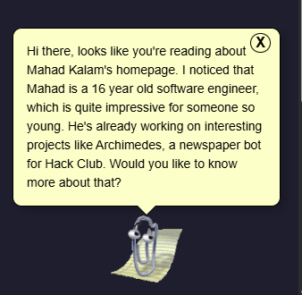

     
    

        
    

    

        clippy for your browser
    

    

        <a href="https://chromewebstore.google.com/detail/clippy-two/hiipphjaeikpijmonamnkefogfjbjhph">
            chrome web store
        </a>
    

     

Need a bit of whimsy whilst you browse the web? Clippy Two is Clippy for your browser! Why? Why not :P

---

Made by Mahad Kalam. All rights reserved!
